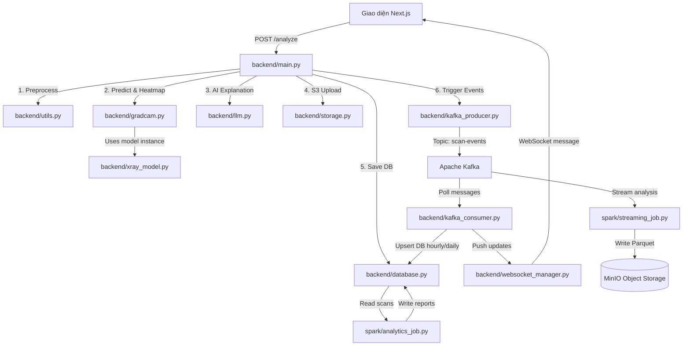

# TÀI LIỆU CHI TIẾT KIẾN TRÚC VÀ LUỒNG DỰ ÁN X-RAY DIAGNOSIS PIPELINE

Tài liệu này mô tả chi tiết toàn bộ dự án **XRay Data Engineering Platform** (XRayDetection), bao gồm cấu trúc mã nguồn, ngăn xếp công nghệ (tech stack), thiết kế cơ sở dữ liệu, sơ đồ luồng dữ liệu cấp mã nguồn (theo triết lý cây cú pháp AST / Dependency Mapping tương tự GitNexus), luồng hoạt động thời gian thực và cách thức vận hành hệ thống.

---

## 1. Tổng Quan Hệ Thống

Hệ thống được thiết kế để xử lý dữ liệu ảnh X-quang ngực, thực hiện chẩn đoán tự động bằng học sâu, sinh bản đồ nhiệt bệnh lý (Grad-CAM), dùng mô hình ngôn ngữ lớn (Gemini 2.5 Flash / LLaVA) để diễn giải bằng ngôn ngữ tự nhiên, và tổ chức luồng xử lý Big Data thời gian thực.

```
       [Client/Giao diện Next.js] 
            │            ▲
      HTTP  │            │ WebSocket (Real-time update)
            ▼            │
     ┌────────────────────────┐
     │   FastAPI Backend      │ 
     └──────────┬─────────────┘
                │
        ┌───────┴───────────────┐
        ▼                       ▼
   [MinIO (S3)]          [PostgreSQL 16] 
  (Raw & Heatmaps)      (Metadata & Analytics)
        │                       ▲
        │                       │
        └───────── [Apache Spark (Streaming / Batch)] ◄─── [Apache Kafka]
```

---

## 2. Ngăn Xếp Công Nghệ (Technology Stack)

| Thành phần | Công nghệ | Vai trò & Đặc tả kỹ thuật |
| :--- | :--- | :--- |
| **Core Backend** | FastAPI | Python 3.11+, chạy async/await, cung cấp RESTful APIs và WebSockets endpoint. |
| **Deep Learning** | TorchXRayVision | Model `DenseNet121` huấn luyện trên tập dữ liệu y tế quy mô lớn (`densenet121-res224-all`), hỗ trợ phát hiện 18 loại bệnh lý phổi. |
| **Heatmap Visualization** | Grad-CAM | Trích xuất đặc trưng không gian ở convolutional layer cuối cùng để tạo bản đồ nhiệt nghi ngờ tổn thương. |
| **GenAI (LLM)** | Gemini 2.5 Flash / LLaVA | Đọc kết quả phân tích + ảnh heatmap, xuất báo cáo y khoa định dạng tiếng Việt. |
| **Message Broker** | Apache Kafka | Quản lý luồng sự kiện (event stream) bất đồng bộ với Zookeeper. |
| **Big Data Engine** | Apache Spark | Chạy Spark Structured Streaming và các Spark Batch Jobs để tổng hợp dữ liệu lớn. |
| **Database** | PostgreSQL 16 | Lưu trữ thông tin bệnh nhân, kết quả scan, lịch sử sự kiện Kafka, và các báo cáo tổng hợp. |
| **Object Storage** | MinIO (Self-hosted S3) | Lưu trữ vĩnh viễn tệp ảnh gốc (JPG/DICOM) và ảnh Grad-CAM heatmap (PNG). |
| **Cache & State** | Redis 7 | Lưu trữ tạm thời trạng thái và hỗ trợ giám sát hệ thống. |
| **Frontend UI** | Next.js 14 (React / TS) | Dashboard thời gian thực, biểu đồ xu hướng, giao diện tải lên và xem báo cáo. |
| **Containerization** | Docker & Compose | Đóng gói toàn bộ 11 dịch vụ giúp triển khai đồng bộ. |

---

## 3. Cấu Trúc Mã Nguồn & Bản Đồ Phụ Thuộc (Dependency Mapping)

Dựa trên cấu trúc cuộc gọi hàm và chỉ thị `import` giữa các module (tương tự như cách phân tích cấu trúc của **GitNexus**), dưới đây là bản đồ phụ thuộc và kiến trúc phân lớp của dự án:

```
project/
├── backend/                  # REST API, WebSocket & AI Inference
│   ├── main.py               # Điểm khởi chạy FastAPI, đăng ký routers, quản lý Lifespan
│   ├── xray_model.py         # Singleton khởi tạo model DenseNet121 của TorchXRayVision
│   ├── utils.py              # Tiền xử lý ảnh grayscale, normalize và resize về 224x224
│   ├── gradcam.py            # Tính toán Grad-CAM và sinh ảnh overlay heatmap (matplotlib)
│   ├── llm.py                # Xử lý prompt y khoa, định tuyến gọi Gemini API hoặc LLaVA local
│   ├── storage.py            # Client tương tác MinIO S3 (put_object, proxy, bucket check)
│   ├── database.py           # Quản lý Connection Pool asyncpg, truy vấn CRUD scan
│   ├── kafka_producer.py     # Đóng gói AIOKafkaProducer để gửi sự kiện vào Kafka
│   ├── kafka_consumer.py     # Background listener tiêu thụ Kafka event, cập nhật DB & WebSocket
│   └── websocket_manager.py  # Quản lý danh sách kết nối WebSocket đang hoạt động
├── spark/                    # Phân tích dữ liệu lớn
│   ├── streaming_job.py      # Tiêu thụ Kafka Stream, tổng hợp qua Tumbling Window 5 phút, lưu Parquet
│   └── analytics_job.py      # Batch Job định kỳ tổng hợp PostgreSQL lịch sử, xuất báo cáo
├── db/                       # Cơ sở dữ liệu
│   ├── init.sql              # Thiết kế schema, indexes, hàm PL/pgSQL
│   └── backfill.sql          # Dữ liệu mẫu khởi tạo ban đầu
├── frontend/                 # Giao diện Next.js
│   └── src/
│       ├── app/              # Các routes: dashboard, upload, analytics, reports
│       ├── components/       # Các widget biểu đồ (Recharts) và SystemHealth monitor
│       └── hooks/            # useWebSocket và useAnalytics quản lý kết nối
└── docker-compose.yml        # Định nghĩa 11 container dịch vụ liên kết
```

### Sơ đồ luồng gọi hàm nội bộ (AST Call Graph):



---

## 4. Thiết Kế Cơ Sở Dữ Liệu (PostgreSQL Schema)

Cơ sở dữ liệu được thiết kế tối ưu cho cả tác vụ ghi (OLTP) của backend lẫn tác vụ đọc tổng hợp (OLAP) của Spark/Dashboard:

### 1. Bảng `scans` (Thông tin chụp và chẩn đoán gốc)
Lưu trữ thông tin chi tiết của từng lượt chụp X-quang:
* `id` (UUID): Khóa chính mặc định sinh ngẫu nhiên.
* `created_at` (TIMESTAMPTZ): Thời điểm ghi nhận.
* `image_key` / `heatmap_key` (TEXT): Đường dẫn tệp tin lưu trên MinIO (`originals/{id}.jpg` và `heatmaps/{id}.png`).
* `top_disease` (TEXT): Bệnh lý có điểm số cao nhất sau khi lọc qua ngưỡng threshold.
* `scores` (JSONB): Điểm số chi tiết của cả 18 bệnh (ví dụ: `{"Pneumonia": 0.82, "Effusion": 0.12}`).
* `is_normal` (BOOLEAN): Đánh dấu ca khỏe mạnh (không phát hiện bất thường vượt ngưỡng).
* `explanation` (TEXT): Báo cáo chẩn đoán bằng tiếng Việt do LLM tạo ra.
* `processing_time_ms` (INTEGER): Thời gian từ lúc nhận ảnh đến khi hoàn tất lưu trữ.
* `status` (TEXT): Trạng thái (`submitted`, `processing`, `completed`, `failed`).
* `source` (TEXT): Nguồn gửi yêu cầu (`web`, `api`, `mobile`, `batch`).
* `ai_model_used` (TEXT): Model LLM được chỉ định giải thích (`gemini`, `llava`).

### 2. Bảng `scan_events` (Nhật ký sự kiện Kafka)
Ghi nhận toàn bộ vết xử lý của từng ca scan để phục vụ audit và gỡ lỗi (debugging):
* `scan_id` (UUID), `event_type` (TEXT), `event_data` (JSONB), `created_at` (TIMESTAMPTZ), `kafka_offset` (BIGINT), `kafka_partition` (INTEGER).

### 3. Bảng phân tích tổng hợp (`analytics_hourly` & `analytics_daily`)
Các bảng này lưu trữ dữ liệu đã được tính toán sẵn (pre-aggregated) để dashboard truy vấn cực nhanh mà không cần quét lại toàn bộ bảng `scans` khổng lồ:
* Tổng số ca (`total_scans`), số ca bình thường (`normal_scans`), bất thường (`abnormal_scans`).
* Thời gian xử lý trung bình cập nhật liên tục (`avg_processing_ms`).
* Phân phối số ca theo bệnh lý (`disease_counts` dưới dạng JSONB).
* Phân phối số ca theo nguồn gửi (`source_counts` dưới dạng JSONB).

### 4. Hàm PL/pgSQL tự động tính toán (Stored Procedures)
Khi Kafka Consumer nhận được sự kiện `scan.completed`, nó sẽ gọi hai hàm dưới đây để cập nhật số liệu phân tích:

* **`upsert_hourly_analytics(...)`**: Làm tròn thời gian của scan về đầu giờ (`date_trunc('hour', timestamp)`), thực hiện chèn mới hoặc cộng dồn số ca, cập nhật lại thời gian xử lý trung bình bằng công thức:
  $$\text{avg}_{\text{new}} = \frac{\text{avg}_{\text{old}} \times \text{total}_{\text{old}} + \text{duration}}{\text{total}_{\text{old}} + 1}$$
  Đồng thời dùng toán tử ghép nối JSONB (`||`) để tăng số đếm bệnh lý và nguồn gửi tương ứng.
* **`upsert_daily_analytics(...)`**: Tương tự như hàm theo giờ nhưng làm tròn thời gian về ngày (`DATE`) để vẽ các báo cáo chu kỳ dài hạn.

---

## 5. Luồng Xử Lý Dữ Liệu Thời Gian Thực (Real-time Data Flow)

Khi một tệp tin ảnh chụp X-quang được gửi đến API `/analyze` trên FastAPI:

### Giai đoạn 1: Tiếp nhận và Chẩn đoán (FastAPI Backend)
1. Backend tiếp nhận payload HTTP dạng Form (chứa file ảnh, mã bệnh nhân `patient_id`, loại model LLM sử dụng và nguồn gửi).
2. Gửi sự kiện `scan.submitted` và `scan.processing` vào Kafka thông qua thư viện `aiokafka`.
3. Ảnh X-quang được tiền xử lý: chuyển sang ảnh xám (grayscale) nếu là ảnh màu, chuẩn hóa dải pixel từ $[0, 255]$ về $[-1024, 1024]$, resize về kích thước chuẩn đầu vào $224 \times 224$ và chuyển thành Tensor PyTorch có dạng `(1, 1, 224, 224)`.
4. Đưa Tensor qua mô hình **DenseNet121** của TorchXRayVision ở chế độ eval (`model.eval()`).
5. Nếu phát hiện xác suất của bệnh lý cao nhất lớn hơn ngưỡng quy định ($75\%$):
   - Kích hoạt lớp Grad-CAM nhắm mục tiêu vào chỉ số bệnh đó.
   - Trích xuất gradient để tạo bản đồ nhiệt Grad-CAM, kết xuất thành ảnh màu định dạng PNG chồng lên ảnh gốc.
6. Ảnh gốc và ảnh heatmap được lưu trữ đồng thời lên MinIO.
7. Backend gửi kết quả điểm số cùng ảnh heatmap (dưới dạng Base64) đến API Gemini 2.5 Flash hoặc LLaVA local. LLM phản hồi báo cáo chẩn đoán cấu trúc bằng tiếng Việt.
8. Ghi dữ liệu hoàn tất vào PostgreSQL và gửi sự kiện `scan.completed` vào Kafka. Trả kết quả HTTP code 200 về cho client.

### Giai đoạn 2: Điều phối sự kiện và Cập nhật Giao diện (Kafka -> WebSocket)
1. Dịch vụ Kafka broker chuyển tiếp sự kiện `scan.completed` đến Consumer Group `xray-analytics-consumer`.
2. Background Kafka consumer của backend bắt được sự kiện này:
   - Ghi thông tin event vào bảng `scan_events`.
   - Chạy các hàm SQL `upsert_hourly_analytics` và `upsert_daily_analytics` để đồng bộ chỉ số báo cáo ngay lập tức.
   - Đẩy gói tin JSON chứa chi tiết sự kiện cho `WebSocketManager`.
3. `WebSocketManager` phát sóng (broadcast) gói tin đến toàn bộ các trình duyệt đang kết nối vào endpoint `/ws/dashboard`.
4. Dashboard trên Next.js nhận được thông điệp, cập nhật biểu đồ phân phối bệnh lý, danh sách ca quét gần đây và nâng cao các KPI tương ứng trên màn hình ngay lập tức mà không cần F5.

---

## 6. Xử Lý Dữ Liệu Lớn Với Apache Spark

Dự án triển khai một cụm Apache Spark (gồm 1 Spark Master và 1 Spark Worker) để xử lý dữ liệu lớn ở cả hai dạng: Streaming (Dòng) và Batch (Mẻ).

### 1. Luồng Streaming (`spark/streaming_job.py`)
* **Nhiệm vụ**: Theo dõi trực tiếp dòng sự kiện Kafka để đưa ra các phân tích cận thời gian thực (near-realtime).
* **Luồng chạy**:
  - Đăng ký nhận luồng dữ liệu liên tục từ Kafka Bootstrap server trên topic `scan-events`.
  - Phân tách cấu trúc JSON thô của sự kiện để trích xuất các cột: `is_normal`, `processing_time_ms`, `source`, `top_disease`.
  - Áp dụng cấu hình Watermark 10 phút (`withWatermark("kafka_timestamp", "10 minutes")`) để xử lý các gói tin đến trễ do độ trễ mạng y tế.
  - Phân tích gộp theo cửa sổ thời gian 5 phút (Tumbling Window), đếm tổng số ca scan, số ca bình thường/bất thường, và thời gian xử lý trung bình.
  - Ghi luồng kết quả định kỳ mỗi 30 giây dưới dạng các tệp định dạng **Parquet** nén vào MinIO Object Storage tại đường dẫn `s3a://xray-data/spark-output/streaming_windows`.

### 2. Luồng Batch (`spark/analytics_job.py`)
* **Nhiệm vụ**: Phân tích sâu dữ liệu lịch sử trên quy mô lớn để phát hiện xu hướng dài hạn.
* **Luồng chạy**:
  - Đọc trực tiếp toàn bộ dữ liệu lịch sử từ PostgreSQL thông qua kết nối JDBC Driver.
  - Thực hiện 6 phép toán tổng hợp lớn song song:
    1. **Daily Summary**: Thống kê số ca scan, số ca độc bản của bệnh nhân, số lượng bệnh lý khác nhau theo từng ngày.
    2. **Disease Frequency**: Xếp hạng phần trăm xuất hiện của từng bệnh lý trên quy mô toàn bộ dữ liệu.
    3. **Hourly Pattern**: Phân tích lưu lượng quét theo từng khung giờ trong ngày (0 - 23h) để tìm ra khung giờ cao điểm của bệnh viện.
    4. **Disease Trend**: Phân tích biến động số ca bệnh theo từng tuần trong năm để theo dõi diễn biến dịch bệnh lý.
    5. **Source Analysis**: Đánh giá hiệu suất và số lượng ca gửi từ các nguồn khác nhau (Web, Mobile, API đối tác).
    6. **Processing Time Distribution**: Chia thời gian xử lý thành các phân đoạn (dưới 500ms, 500ms-1s, 1s-2s, trên 5s) để tối ưu hạ tầng phần cứng.
  - Ghi toàn bộ kết quả phân tích dưới dạng thư mục Parquet phân vùng theo thời gian vào MinIO để lưu trữ lâu dài.

---

## 7. Các Tính Năng Chi Tiết Trên Giao Diện Frontend (Next.js)

Giao diện Next.js được xây dựng theo phong cách hiện đại với nền tối (dark mode) tinh tế, tối ưu hóa trải nghiệm y khoa chuyên nghiệp:

### 1. Trang Dashboard (`/dashboard`)
* **Live Clients Counter**: Hiển thị số lượng bác sĩ/máy khách đang trực quan hóa hệ thống theo thời gian thực nhờ kết nối duy trì qua WebSocket.
* **Biểu đồ chuỗi thời gian**: Sử dụng Recharts để vẽ biểu đồ diện tích (Area Chart) thể hiện tổng lượng scan và phân bổ ca bất thường theo thời gian thực.
* **Biểu đồ tròn bệnh lý**: Vẽ cơ cấu tỉ lệ phần trăm của các bệnh lý phổi khác nhau được phát hiện.
* **Hộp giám sát sức khỏe hệ thống (System Health)**: Biểu thị trực quan các biểu tượng màu xanh lá (nếu Up) hoặc đỏ (nếu Down) kèm theo thông báo chi tiết lỗi kết nối của từng thành phần Postgres, MinIO, Kafka và Redis.

### 2. Trang Phân Tích Chuyên Sâu (`/analytics`)
* **Calendar Heatmap**: Mỗi ô vuông đại diện cho 1 ngày, màu sắc chuyển từ xanh nhạt sang xanh đậm biểu thị lưu lượng quét tăng dần, giúp phát hiện nhanh các ngày quá tải.
* **Tabs chuyển đổi nhanh**: Dễ dàng chuyển hướng xem đồ thị xu hướng thời gian (Area/Line), đồ thị phân tích bệnh lý (Donut/Bar) hoặc xem trực tiếp bảng nhật ký tổng hợp hàng ngày.

### 3. Trang Báo Cáo Spark (`/reports`)
* Danh sách các báo cáo Batch tổng hợp từ Apache Spark.
* Cho phép chọn từng báo cáo để xem phân tích nâng cao (lượng bệnh nhân duy nhất, thời gian xử lý phân vị P50/P95, danh sách giờ cao điểm).
* Tích hợp khung hiển thị mã nguồn Raw JSON định dạng đẹp mắt để các kỹ sư dữ liệu dễ dàng truy xuất thông số thô.

### 4. Trang Upload Chẩn Đoán (`/upload`)
* Cung cấp khung kéo thả file ảnh chụp X-quang.
* Lựa chọn mô hình AI phân tích (Gemini Cloud hoặc LLaVA Local).
* Hiển thị bảng so sánh độ tự tin của mô hình cho từng bệnh lý và khung báo cáo chẩn đoán bằng tiếng Việt do LLM phản hồi.

---

## 8. Hướng Dẫn Vận Hành Hệ Thống

### 1. Khởi chạy toàn bộ hệ thống
Khởi chạy đồng bộ tất cả 11 dịch vụ container bằng lệnh:
```bash
docker compose up --build -d
```

### 2. Thiết lập Gemma 3/4 (Nếu chạy LLaVA/Gemma local qua Ollama)
Nếu bạn chọn cấu hình chạy offline hoàn toàn để bảo vệ dữ liệu bệnh nhân nhạy cảm:
```bash
# Tải mô hình vision LLaVA hoặc Gemma 3/4 về container Ollama
docker compose exec ollama ollama pull llava
```

### 3. Khởi chạy thủ công Spark Batch Analytics Job
Để cập nhật dữ liệu báo cáo chuyên sâu trên trang "Spark Reports":
```bash
docker compose exec spark-master spark-submit \
  --packages org.postgresql:postgresql:42.7.1,org.apache.hadoop:hadoop-aws:3.3.4,com.amazonaws:aws-java-sdk-bundle:1.12.262 \
  /opt/spark-apps/analytics_job.py
```

### 4. Các cổng kết nối mặc định trên localhost
* **FastAPI Backend (Tài liệu API)**: [http://localhost:8000/docs](http://localhost:8000/docs)
* **Next.js Frontend**: [http://localhost:3000](http://localhost:3000)
* **MinIO Console (Quản lý file)**: [http://localhost:9001](http://localhost:9001)
* **Kafka UI (Giám sát hàng đợi)**: [http://localhost:8080](http://localhost:8080)
* **Spark Web UI (Giám sát cụm Spark)**: [http://localhost:8081](http://localhost:8081)
