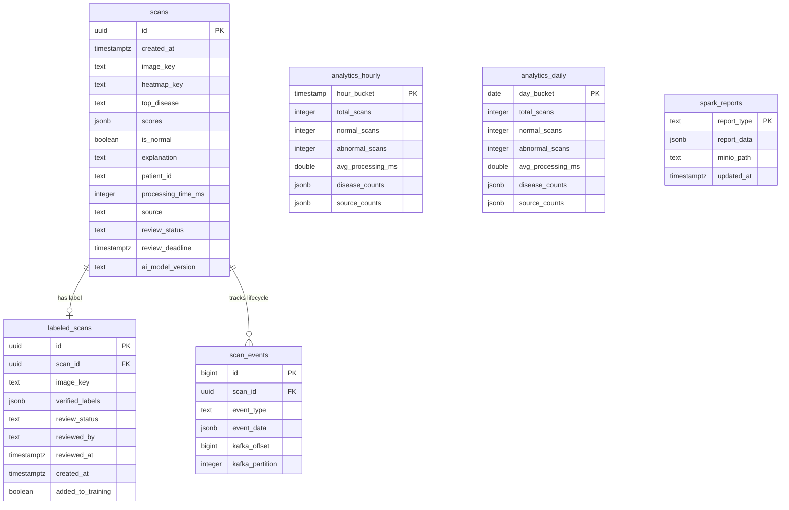

# TÀI LIỆU TỔNG QUAN HỆ THỐNG X-RAY DIAGNOSIS & MODEL CYCLING PLATFORM

Tài liệu này mô tả chi tiết kiến trúc vi dịch vụ (Microservices), các công nghệ sử dụng, luồng hoạt động chẩn đoán thời gian thực, chu trình quản lý vòng đời mô hình học máy (MLOps Model Cycling), thiết kế cơ sở dữ liệu và cách thức vận hành hệ thống.

---

## 1. Công Nghệ Sử Dụng (Technology Stack)

Hệ thống được xây dựng như một nền tảng dữ liệu y khoa hiệu năng cao kết hợp giữa trí tuệ nhân tạo (Deep Learning & LLM), MLOps, xử lý dữ liệu lớn thời gian thực và kiến trúc hướng sự kiện:

| Thành phần | Công nghệ | Vai trò & Mô tả |
| :--- | :--- | :--- |
| **Giao diện (Frontend)** | Next.js 14, React, TailwindCSS | Dashboard giám sát thời gian thực, Live Feed sự kiện, Analytics chuyên sâu, giao diện Bác sĩ phê duyệt (Review) và Sổ quản lý mô hình (Models). |
| **API Server (Backend)** | FastAPI (Python 3.11+) | Cung cấp RESTful APIs cho client, kết nối WebSocket đẩy tin trực tiếp, lưu trữ ảnh gốc/Grad-CAM proxy. |
| **Phân tích X-quang (AI)** | TorchXRayVision (DenseNet121) | Trích xuất dự đoán 18 loại bệnh lý từ ảnh X-quang ngực thẳng. |
| **Bản đồ giải thích** | Grad-CAM++ | Trích xuất vùng nóng tổn thương từ lớp BatchNorm cuối cùng `norm5` giúp chẩn đoán trực quan (XAI). |
| **GenAI Giải thích** | Gemini API (Fallback 1.5/2.5) | Gọi Google Generative Language API (hoặc Ollama local) phân tích điểm số và heatmap để xuất lời giải thích bằng Tiếng Việt. |
| **Hệ thống hàng đợi** | Apache Kafka & Zookeeper | Broker luồng chẩn đoán thời gian thực (`scan-events`), truyền thông tin bất đồng bộ tin cậy. |
| **Phân tích lớn** | Apache Spark (Streaming & Batch) | Phân tích dòng dữ liệu từ Kafka (Streaming) và chạy các job tổng hợp dữ liệu lịch sử lưu trữ lâu dài dưới dạng Parquet. |
| **Cơ sở dữ liệu** | PostgreSQL 16 | Lưu trữ hồ sơ chẩn đoán, dữ liệu hàng đợi huấn luyện, tổng hợp thống kê theo giờ/ngày thông qua PL/pgSQL. |
| **Bộ nhớ đệm** | Redis 7 | Caching, duy trì trạng thái kết nối WebSocket và cơ chế System Health. |
| **Lưu trữ đối tượng** | MinIO (S3-compatible Storage) | Bucket chứa ảnh chụp y khoa gốc (`xray-images`), heatmap (`xray-heatmaps`), tệp Parquet (`xray-data`) và model registry (`xray-models`). |
| **Theo dõi Mô hình** | MLflow Server | Sổ đăng ký phiên bản mô hình (Model Registry), theo dõi log tham số và lưu vết metrics (AUC). |
| **Workflow Scheduler** | Apache Airflow | Tự động hóa lịch biểu huấn luyện lại mô hình hàng tuần (gom dữ liệu từ DB, trigger train, update checkpoint). |
| **Containerization** | Docker & Docker Compose | Đóng gói toàn bộ 11 dịch vụ chạy độc lập, vận hành phân tán. |

---

## 2. Luồng Hoạt Động Của Hệ Thống (Platform Pipelines)

Hệ thống vận hành trơn tru dựa trên sự kết hợp chặt chẽ giữa 3 chu kỳ dữ liệu chính:

### 2.1. Chu kỳ Chẩn đoán Thời gian thực (Real-time Diagnosis)
1. **Tải ảnh lên**: Bác sĩ tải ảnh chụp X-quang lên giao diện Next.js, ảnh được gửi đến FastAPI `/analyze`.
2. **AI Inference & Grad-CAM++**: 
   - Backend chuẩn hóa ảnh đầu vào và dự đoán xác suất qua mô hình DenseNet121.
   - Nếu phát hiện bệnh lý có xác suất $> 75\%$, thuật toán **Grad-CAM++** tự động sinh bản đồ nhiệt (heatmap overlay) khoanh vùng nghi ngờ tổn thương.
3. **Gọi AI Giải thích**: Điểm số và ảnh heatmap được gửi đến **Gemini API** để tự động biên soạn báo cáo giải thích tiếng Việt. *Hệ thống tích hợp cơ chế tự động chuyển vùng mô hình (fallback) từ `gemini-2.5-flash` sang `gemini-1.5-flash` hoặc `gemini-3.1-flash-lite` khi gặp lỗi quá tải 503 để duy trì kết nối.*
4. **Lưu trữ**: Ảnh gốc và heatmap được lưu trên MinIO S3. Kết quả chẩn đoán lưu vào PostgreSQL.
5. **Gửi tin realtime**: Gửi sự kiện chẩn đoán thành công vào Kafka topic `scan-events`. 
6. **Live Feed & Analytics**: Kafka Consumer nhận sự kiện, tự động gọi các stored procedure trong PostgreSQL để cộng dồn thống kê KPI đồng thời đẩy gói tin qua WebSocket cập nhật tức thời lên Dashboard.
7. **Spark Streaming**: Spark đọc liên tục luồng Kafka, thực hiện tổng hợp ca bệnh theo cửa sổ thời gian 5 phút và ghi tệp Parquet nén lên MinIO phục vụ phân tích lâu dài.

---

### 2.2. Chu kỳ Phê duyệt của Bác sĩ (Doctor Review Loop)
Hệ thống cho phép bác sĩ lâm sàng kiểm tra, gắn nhãn chính xác và đẩy dữ liệu chẩn đoán chất lượng cao vào tập huấn luyện tiếp theo:
1. **Tabs làm việc**: 
   - **Chưa xác nhận**: Hiển thị các ca quét chẩn đoán ban đầu. AI tự động tích sẵn các bệnh lý có xác suất $> 60\%$.
   - **Đã xác nhận**: Hiển thị các ca quét bác sĩ đã hoàn tất phê duyệt.
2. **Giao diện phản hồi trực quan (Strikethrough)**: Khi bác sĩ bỏ tích (loại trừ) một phán đoán của AI ở bất kỳ tab nào, tên bệnh lý đó trong bảng "Phán đoán của AI" sẽ lập tức hiển thị **gạch ngang** kèm dấu `✗` và thanh tiến trình chuyển sang màu xám để phản hồi trực quan trực tiếp.
3. **Phê duyệt hàng loạt**: Nút "Xác nhận toàn bộ" cho phép phê duyệt hàng loạt các ca chờ duyệt dựa trên chẩn đoán ban đầu của AI ($>60\%$) để tối ưu thời gian.
4. **Lưu trữ hàng đợi huấn luyện (Upsert)**: Khi bác sĩ bấm "Xác nhận kết quả", dữ liệu nhãn thực tế được lưu vào bảng `labeled_scans` với trạng thái `approved`. Hệ thống tự động thực hiện cơ chế **Upsert** (nếu ca quét đã duyệt trước đó được sửa lại, bản ghi cũ sẽ được cập nhật thay vì tạo dòng mới trùng lặp).
5. **Image Proxy**: Thay vì sinh URL presigned nhạy cảm của MinIO (thường bị lỗi DNS loopback và CORS trên máy khách), backend cung cấp một endpoint proxy trung gian (`/images/{key}`) giúp trình duyệt tải ảnh trực tiếp, mượt mà và bảo mật.

---

### 2.3. Chu kỳ Huấn luyện & Cập nhật Mô hình (MLOps Model Cycling)
Khi bác sĩ chẩn đoán tích lũy đủ dữ liệu y khoa thực tế, chu trình cập nhật mô hình được kích hoạt:
1. **Kích hoạt Train Job**:
   - Người dùng bấm "Huấn luyện mô hình" từ trang Review hoặc Models.
   - Giao diện cung cấp dropdown cho phép chọn **Mô hình nền (Base Model)**: Huấn luyện lại hoàn toàn từ đầu (mô hình DenseNet121 mặc định của TorchXRayVision) hoặc tải tệp trọng số checkpoint (`model_v{version}.pt`) của một phiên bản mô hình cụ thể trong Registry để **huấn luyện tiếp tục (incremental fine-tuning)**.
   - Backend khởi chạy pipeline huấn luyện PyTorch độc lập (ở chế độ LOCAL bảo mật thông tin nội bộ).
2. **Đăng ký MLflow & Đồng bộ Baseline AUC**:
   - Khi huấn luyện kết thúc, mô hình mới được log vào **MLflow Registry** ở trạng thái **Chờ duyệt (Staging)**.
   - Do lượng dữ liệu mẫu ban đầu nhỏ dễ dẫn đến tính toán AUC bị `NaN` và bị ẩn, backend áp dụng cơ chế tự động **trộn và điền baseline AUC mặc định (DEFAULT_PRETRAINED_METRICS)** dựa trên hiệu năng chuẩn của DenseNet121 pre-trained (trung bình 81.3% AUC trên 19 bệnh lý).
   - Mô hình có bệnh lý được fine-tune thực tế sẽ tự động ghi đè và tính toán lại AUC trung bình tương ứng.
3. **Quy trình Promote nâng cấp**:
   - Trên trang Models, khi bấm "Đưa vào Production" cho bản Staging, một modal overlay cao cấp sẽ hiển thị so sánh trực quan hiệu suất:
     - So sánh AUC trung bình tổng thể giữa mô hình Staging và mô hình Production hiện tại.
     - Liệt kê bảng so sánh AUC chi tiết của từng bệnh lý và tính phần trăm tăng/giảm tương quan (ví dụ: `+2%` màu xanh lá hoặc `-1%` màu đỏ).
   - Bác sĩ bấm "Xác nhận nâng cấp", MLflow sẽ chuyển stage phiên bản đó thành **Production**, đồng thời ModelManager của API chẩn đoán sẽ tự động kích hoạt **tải nóng tệp trọng số mới về bộ nhớ đệm** để phục vụ trực tiếp các ca quét tiếp theo ngay lập tức (không cần dừng hay khởi động lại backend).

---

## 3. Cấu Trúc Mã Nguồn Monorepo

```
XRayDetection/
├── backend/                   # FastAPI Backend Service
│   ├── main.py                # API Gateway, WebSocket điều phối
│   ├── xray_model.py          # ModelManager tải nóng trọng số mô hình
│   ├── gradcam.py             # Sinh heatmap Grad-CAM++ & tự động vẽ bounding box
│   ├── llm.py                 # Sinh lời giải thích Gemini (Fallback 1.5/2.5)
│   ├── database.py            # Asyncpg pool quản lý kết nối PostgreSQL
│   ├── storage.py             # SDK tương tác với kho lưu trữ đối tượng MinIO
│   ├── routers/               # Routers logic: batch, review, training
│   └── services/              # Nghiệp vụ: inference, label_service, model_registry, training_service
├── frontend/                  # Next.js 14 Frontend Service (React + Tailwind)
│   └── src/
│       ├── app/               # Routes: dashboard, upload, analytics, models, review
│       ├── components/        # ImageSlider, DiseaseCheckbox, TrainingStatus, TimeSeriesChart
│       └── utils/             # Hàm tiện ích (translateDisease...)
├── spark/                     # Apache Spark Engine (Structured Streaming & Batch analysis)
│   ├── streaming_job.py       # Phân tích luồng Kafka realtime -> ghi Parquet nén S3
│   └── analytics_job.py       # Batch job phân tích 6 chiều dữ liệu lịch sử PostgreSQL
├── airflow/                   # Apache Airflow Orchestration
│   ├── dags/                  # Dags: review_timeout_dag.py, weekly_training_dag.py
│   └── Dockerfile             # Cấu hình cài đặt môi trường chạy DAG
├── db/                        # Cơ sở dữ liệu PostgreSQL 16
│   ├── init.sql               # Định nghĩa schema bảng, stored procedure PL/pgSQL
│   └── migrations/            # Quản lý lịch sử nâng cấp schema DB (ví dụ: bảng labeled_scans)
└── docker-compose.yml         # File compose liên kết, cấu hình cổng mạng cho 11 dịch vụ
```

---

## 4. Thiết Kế Cơ Sở Dữ Liệu Chi Tiết (PostgreSQL 16)



### Chỉ mục chính tối ưu hóa hiệu năng (Indexing Strategy):
* `idx_scans_created_at` (B-Tree): Tối ưu truy vấn Live Feed sắp xếp mới nhất.
* `idx_scans_scores` (GIN): Inverted index chuyên biệt cho phép tìm kiếm nhanh dữ liệu xác suất y khoa lồng trong trường `scores` JSONB.
* `idx_labeled_scans_added_to_training`: Index có điều kiện phục vụ gom nhanh các ca đã duyệt để huấn luyện mô hình.

---

## 5. Danh Sách Địa Chỉ Truy Cập Cổng Mạng (Port Map)

Khi triển khai trên môi trường máy cục bộ (localhost), bạn có thể truy cập các cổng mạng dịch vụ sau:

* **Next.js Frontend (Ứng dụng chính)**: [http://localhost:3000](http://localhost:3000)
* **FastAPI Backend Swagger (Tài liệu API)**: [http://localhost:8000/docs](http://localhost:8000/docs)
* **MLflow Tracking Server (Giám sát mô hình)**: [http://localhost:5001](http://localhost:5001)
* **Kafka UI (Giám sát luồng sự kiện Kafka)**: [http://localhost:8088](http://localhost:8088)
* **Apache Spark Web UI (Giám sát cụm Spark Master)**: [http://localhost:8081](http://localhost:8081)
* **MinIO Console (S3 Object Storage Browser)**: [http://localhost:9001](http://localhost:9001) (tài khoản: `minioadmin` / `minioadmin`)
* **Apache Airflow Webserver (Lịch trình tự động hóa)**: [http://localhost:8085](http://localhost:8085) (tài khoản: `admin` / `admin`)
* **PostgreSQL Database**: Port `5432`
* **Redis Cache**: Port `6379`
